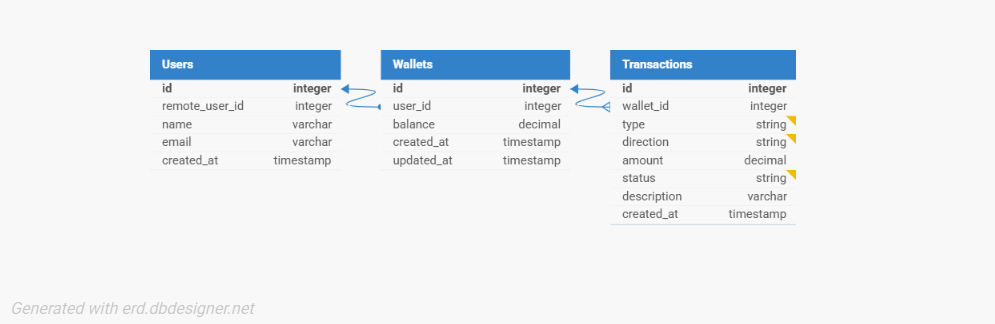

# 💳 Demo Credit Wallet Service

This service manages user wallets and transactions for the Demo Credit platform. It supports wallet creation, funding, transfers, withdrawals, and Adjutor blacklist validation during registration.

---

## 📌 Project Overview

The wallet microservice enables:

- Automatic wallet creation on user registration
- Wallet funding, transfers, and withdrawals
- Transaction logging
- Integration with Adjutor API for blacklist validation
- Faux authentication using static Bearer token (`Authorization: Bearer <user-id>`)

---

## 🏗️ System Design & Folder Structure
```
src/
│
├── adjutor/ # Adjutor API integration
│ ├── adjutor.module.ts
│ ├── adjutor.service.ts
│ └── dto/
│ └── karma-blacklist.dto.ts
│
├── users/
│ ├── user.controller.ts
│ ├── user.module.ts
│ ├── user.service.ts
│ └── entities/user.entity.ts
│
├── wallets/
│ ├── wallet.controller.ts
│ ├── wallet.module.ts
│ ├── wallet.service.ts
│ └── entities/wallet.entity.ts
│
├── transactions/
│ ├── transaction.module.ts
│ ├── transaction.service.ts
│ └── entities/transaction.entity.ts
│
├── middleware/
│ └── faux-auth.middleware.ts
│
├── database/
│ ├── knexfile.js # Knex config
│ └── migrations/ # DB migration scripts
│
├── app.module.ts
└── main.ts
```

## 📡 API Endpoints

### 🧍‍♂️ Register User

**POST** `/users/register`

Headers:
Authorization: Bearer 12345
Body:
```
{
   "name": "osikoyajason",
   "email":"osikoyajason8@gmail.com"
}
```
Response:
```
{
  "status": true,
  "message": "User registered successfully",
  "data": {
    "id": 1,
    "name": "osikoyajason",
    "email": "osikoyajason8@gmail.com",
    "created_at": "2025-07-24T13:13:41.000Z",
    "remote_user_id": 12345
  }
}
```

###  Fund Wallet

**POST** `/wallets/fund`

Headers:  
Authorization: Bearer 12345  
Response:
```
{
  "status": true,
  "message": "Wallet funded successfully",
  "data": {
    "balance": 1000
  }
}
```
###  Withdraw from Wallet

**POST** `/wallets/withdraw`

Headers:  
Authorization: Bearer 12345  
Body:
```
{
  "amount": 500
}
```
Response:
```
{
  "status": true,
  "message": "Withdrawal successful",
  "data": {
    "balance": 500
  }
}
```
###  Transfer Funds

**POST** `/wallets/transfer`

Headers:  
Authorization: Bearer 12345  
Body:
```
{
  "recipientId": 45678,
  "amount": 250
}
```
Response:
```
{
  "status": true,
  "message": "Transfer successful",
  "data": {
    "amount": 250
  }
}
```

###  Adjutor Integration
During registration, the service checks a user’s email against the Adjutor Karma Blacklist API.

If blacklisted (karma_type.karma !== 'Others'), registration is blocked.
Powered by AdjutorService using an API key from the environment.

Endpoint used:

GET https://api.adjutor.com/verification/karma/:email
Authorization: Bearer <API_KEY>

###  E-R Diagram 



## 🧪 How to Run Tests

> ⚠️ _Tests not implemented yet. This section will be updated once test coverage is added._

Expected:
- Unit tests for services using `Jest`
- E2E tests for full request-response cycles

---

## 🖥️ How to Run Locally

### 1. Clone the repo

git clone https://github.com/jasonnawa/demo-credit-wallet-service.git
cd demo-credit-wallet-service

### 2.  Install dependencies
npm install

### 3.  configure env variables(.env.example file)
Create a .env file in the project root

### 4.  run database migrations
npm run migrate:latest

### 5.  start development server
npm run start:dev


## ✅ Status & Todos

- [x] Faux authentication  
- [x] Wallet create / fund / withdraw / transfer  
- [x] Transaction logging  
- [x] Adjutor integration  
- [ ] Tests (unit & e2e)
- [ ] E-R Diagram


